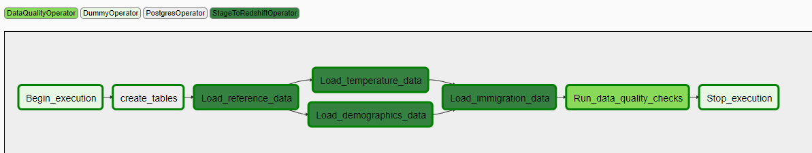

# US immigration I-94 data project

#### Project Summary
Create a data analytics solution using immigration data for year 2016, alongwith supporting city demographics data and temperature data, a data analytics solutions is. The goal is to create data pipelines and consolidate data from multiple sources in order to create a single source of truth data store. This data store will facilitate the immigration department make important decisions based on the insights derived from the data.

The project follows the follow steps:
* Step 1: Scope the Project and Gather Data
* Step 2: Explore and Assess the Data
* Step 3: Define the Data Model
* Step 4: Run ETL to Model the Data
* Step 5: Complete Project Write Up

### Step 1: Scope the Project and Gather Data

#### Scope 
The goal of the project is to deliver a cloud-based data analytics project which will include a high performance data warehouse. The data warehouse can be used to draw insights similar to the ones below:
* Does temperature affect the number of visitors to specific states? Are certain states popular during certain seasons?
* Is there a correlation between the Median Age in a state and I94 state of arrival?
* Number of visitors by visa type/mode of transportation/country of citizenship/country of residence
* Which port of entries are busiest?

##### Architecture

Above is the architecture and high-level steps involved:
* Data will be read from third party locations
* Data will be transformed using Amazon EMR and Apache Spark from raw format to parquet format
* Transformed data will be stored on Amazon S3 (intermediate landing zone) 
* The transformed data in S3 will be loaded in Amazon Reshift data warehouse
* Business users can connect directly to Redshift or use a data visualization tool to draw insights from the enriched data.

Apache Airflow will be used for workflow management in this project.

#### Describe and Gather Data 
##### * I94 Immigration Data: 
This data comes from the US National Tourism and Trade Office. A data dictionary is included in the workspace. This is where the data comes from [here](https://travel.trade.gov/research/reports/i94/historical/2016.html). There's a sample file so you can take a look at the data in csv format before reading it all in. You do not have to use the entire dataset, just use what you need to accomplish the goal you set at the beginning of the project.
##### * World Temperature Data: 
This dataset came from Kaggle which gives average temperature by `state`. You can read more about it [here](https://www.kaggle.com/berkeleyearth/climate-change-earth-surface-temperature-data?select=GlobalLandTemperaturesByState.csv).
##### * U.S. City Demographic Data: 
This data comes from OpenSoft. You can read more about it [here](https://public.opendatasoft.com/explore/dataset/us-cities-demographics/export/).
##### * Airport Code Table: 
This is a simple table of airport codes and corresponding cities. It comes from [here](https://datahub.io/core/airport-codes#data). 

### Step 2: Explore and Assess the Data
#### Explore the Data 
Please refer `exploratory data analysis/ExploratoryDataAnalysis_*.ipynb` files attached for detailed analysis

#### Exploration Summary:
* <b>Immigration data</b>: There are 12 sas7bat files, one for each month of the year 2016. Below is the summary of files showing number of rows/columns for each month. We notice that the data for June 2016 has more columns than the remaining files and hence need special processing as compared to the other months. In addition, a few columns will be dropped as they are not relevant to our project.
* <b>US demographics data</b>: This data will be used in relation to the state of arrival column in immigration data. To address the level of detail, this data set will be rolled up to show state-wise demographic information by aggregrating and pivoting. The end product of this transformation will be a consolidated table of demographic information by state. 
* <b>Global Temperature data by State</b>: This data will be used in relation to the state of arrival column in immigration data. We will aggregate this data because data only until 2013 are provided whereas our immigration data is for 2016. Keeping detailed temperature data will not be very helpful. Hence to address the level of detail, this data set will be filtered to retrieve records 1995 onwards so that it is more relevant to current date and then average temperature by month will be aggregated. The end product of this transformation will be a consolidated table of monthly average temperature information by state, country. We will enrich this data to include state code for the states in USA.
* <b>I94_SAS_Labels_Descriptions </b>: We extract reference information about country of citizenship/residence, ports of entry, state of arrival, mode of transportation, visa types from this data.
* <b>Airport Code data </b>: Since this data does not have direct relation with the immigration data, we will skip this dataset from our analysis.

#### Cleaning Steps
Please see `exploratory data analysis/spark_etl.ipynb` file attached for detailed clean up steps. All the clean data is stored on S3 which will be eventually be loaded to the data warehouse.

### Step 3: Define the Data Model
#### 3.1 Conceptual Data Model
* SELECT BUSINESS PROCESS:
  Analyze US I-94 immigration data for year 2016. We will be focusing on temperature and demographic data in the US for this project.
 
* DECLARE GRAIN:
  Immigration data at transaction level .i.e. Entry/exit details of travelers to/from USA
  
* IDENTIFY DIMENSIONS:
  - DIM_DEMOGRAPHICS - Contains demographical information of US states
  - DIM_TEMPERATURE - Contains monthly average temperature data for various states in the US
  - DIM_I94_CIT_RES - Contains country codes and names for country of citizenship/residence
  - DIM_194_ADDR - Contains US state codes and names
  - DIM_I94_PORT - Contains ports of entry codes, their cities and state/country
  - DIM_I94_MODE - Contains code for mode of travel and description (1-Air, 2-Sea, 3-Land, 9-Not Reported)
  - DIM_I94_VISA - Contains visa codes and description (1-Business, 2-Pleasure, 3-Student)
  
* IDENTIFY FACTS:
  - FACT_IMMIGRATION - Contains immigration data at transaction level .i.e. Entry/exit of travelers to the US

##### ER Diagram

#### 3.2 Mapping Out Data Pipelines
Below are the detailed steps
* Data will read from third party locations using `spark_etl.py`.
* Data will transformed using pandas and Apache Spark from raw format to parquet/csv format through `spark_etl.py`.
* Transformed data will be stored on Amazon S3 (intermediate landing zone) using `spark_etl.py`.
* The transformed data in S3 will be loaded in Amazon Reshift data warehouse using airflow.

`spark_etl.py` will clean and transform data. It will prepare data and store it in intermediate S3 landing zone. 

#### List of files for running the data pipeline and their purpose:
* `spark_etl.py`: Cleans and transforms data to make it ready to be loaded to the data warehouse
* `dl.cfg`: Contains all the setup and configuration information for access to cloud solutions
* `dags/project_dag.py`: Co-ordinates and runs the data pipeline using airflow
* `dags/create_tables.sql`: Contains DDL for creating tables in data warehouse
* `plugins/operators/data_quality.py`: Custom airflow operator for running data quality checks after loading data in data warehouse
* `plugins/operators/data_quality.py`: Custom airflow operator for for loading data from S3 to Redshift data warehouse

### Step 4: Run Pipelines to Model the Data 
#### 4.1 Create the data model
Using airflow, the reference tables are created (i.e. SAS labels descriptions data). This is done first because reference data is used for enriching temperature data.
Once the reference data is loaded, the next set of dimensions are loaded in Redshift (i.e. temperature data and demographic data).
After the dimension tables are loaded, the main fact table is loaded with I94 immigration data.

##### ER Diagram

#### 4.2 Data dictionary 
##### DIM_I94_CIT_RES: - Contains country codes and names for country of citizenship/residence

| Column Name  |   Column Type  |  Description      |
| ------------ | -------------- | ------------------|
| cit_res_id   |   INT          |  Code for country | 
| country_name |   VARCHAR      |  Country          |

##### DIM_I94_PORT: - Contains ports of entry codes, their cities and state/country

|  Column Name     |  Column Type   |  Description                   |
| ----| --| ----|
|poe_code       |  VARCHAR       | port of entry code             |
|city           |  VARCHAR       | City of port of entry          |
|state_or_country  |  VARCHAR       | Name of the state oor country  |

##### DIM_I94_MODE: - Contains code for mode of travel and description (1-Air, 2-Sea, 3-Land, 9-Not Reported)
|  Column Name |  Column Type   |  Description         |  
| ------------ | -------------- | ---------------------|  
| travel_mode  |   INT          |  ID of the mode      |
| mode_name    |   VARCHAR      |  Description of mode | 

##### DIM_I94_VISA: - Contains visa codes and description (1-Business, 2-Pleasure, 3-Student)
|Column Name   |   Column Type  | Description |
| ------------ | -------------- | ---------------------|
|visa_code     |        INT     |      ID for visa type |
|visa_category |       VARCHAR  |     Description of visa type |

##### DIM_I94_ADDR: - Contains US state codes and names
|Column Name   |   Column Type  | Description          |
| ------------ | -------------- | ---------------------|
|state_code    |    VARCHAR     |  Code of the state   |
|state_name    |    VARCHAR     |  Name of the state   |

##### DIM_DEMOGRAPHICS: - Contains demographical information of US states
|Column Name            |   Column Type  |  Description   |
| ------------ | -------------- | ------------------|                                           
|state_name             |    VARCHAR     |   name of the State |
|state_code             |    VARCHAR     |   Code of the state |
|median_age             |    FLOAT       |   Median Age in the state |
|female_pop             |     INT        |   Female population in the state |
|total_pop              |     INT        |   Total population in the state |
|no_of_vets             |    INT         |   Number of veterans in the state |
|foreign_born           |     INT        |   Foreign born veterans in the state |
|avg_household_size     |     FLOAT      |    Average family members in the state |
|amer_ind_ak_native     |      INT       |   Number of american indian and alaska native in the state |
|asian                  |      INT       |    Number of asian in the state |
|black                  |      INT       |    Number of black or african american in the state |
|white                  |    INT         |    Number of white in the state |

##### DIM_TEMPERATURE: - Contains monthly average temperature data for various states in the US at month level
|Column Name      |       Column Type  |  Description |
| ------------ | -------------- | ------------------|
|state_code       |        VARCHAR     |  state code |
|state_name       |        VARCHAR     |  State |
|month            |            INT     |    Month of the year |
|avg_temp         |        FLOAT       | Average Temperature for that month |

##### FACT_IMMIGRATION: - Contains immigration data at transaction level .i.e. Entry/exit of travelers to the US
|Column Name   |   Column Type  | Description |
| ------------ | -------------- | ---------------------|
|cicid	       |    INT         | Primary key ID for record |
|i94yr	       |    INT         | year of entry |
|i94mon	       |    INT         | month of entry |
|i94cit	       |    INT         | Code of country of citizenship |
|i94res	       |    INT         | Code of country of residence |
|i94port	   |        VARCHAR |    Port of entry |
|arrdate	   |        DATE    |    Arrival date in the USA |
|i94mode	   |        INT     |    Mode of travel |
|i94addr	   |        VARCHAR |    US State of arrival |
|age 	       |    INT         | Age of Respondent in Years |
|i94visa	   |        INT     |    Visa type |
|dtadfile	   |    VARCHAR     | Character Date Field, Date added to I-94 Files | 
|biryear	   |        INT     |    4 digit year of birth |
|dtaddto	   |        VARCHAR |    Character Date Field - Date to which admitted to U.S. (allowed to stay until) |
|gender	       |    VARCHAR     | Gender |
|airline	   |        VARCHAR |    Airline used to arrive in U.S. |
|admnum	        |   INT         | Admission number |
|fltno	       |    VARCHAR     | Flight number of Airline used to arrive in U.S. |
|visatype	   |    VARCHAR     | Class of admission legally admitting the non-immigrant to temporarily stay in U.S. |

#### Step 5: Complete Project Write Up
##### Clearly state the rationale for the choice of tools and technologies for the project.
* <b>pandas</b>: pandas is a powerful, and easy to use data analysis python library. We used it heavily for our exploratory data analysis portion of the project.
* <b>Apache Spark: </b> Spark is an distributed data analytics engine. It is highly performant as it provides im-memory storage for intermediate computations and transformations of data. The computations are built as DAGS which executes the queries in optimized manner. In this project, Spark was very helpful as it provided efficient way for cleaning and transforming large amounts of data, which included I94 immigration data containing 40 million records
* <b>Amazon S3: </b> S3 is a highly reliable, available, scalable object storage system in cloud. S3 was used in this project as an intermediate landing zone primarily because it is easily accessible and also it can store large amounts of data in various data formats efficiently.
* <b>Amazon EMR: </b> EMR is a big data platform which can be customized as per the workload at hand. It is highly scalable and performant. In addition, EMR uses EMRFS in the background for file storage, which provides the convenience of storing persistent data in Amazon S3. It was an ideal choice in our case as we are using S3 and Spark which work together seamlessly.
* <b>Amazon Redshift: </b> Redshift is a simple, highly-performant, cost-effective cloud data warehousing service that provides MPP, columnar storage and columnar compression. We chose this solution because of the huge analytic workload of the immigration data. It will provide efficient loading and retrieval of data.

##### Propose how often the data should be updated and why.
* Currently monthly data files are provided, so airflow is scheduled to run monthly. Data in intermediate landing zone can be deleted once the quality checks are successful and complete.

##### Write a description of how you would approach the problem differently under the following scenarios:
 * <b>The data was increased by 100x.</b>
   The tools and technologies we have used are cloud-based which are highly scalable, reliable and elastic. These tools can be scaled up or down automatically or on-demand. In addition, if there is a lot of historical data in the data warehouse and cost is a big factor, then data from Redshift can be unloaded to S3 and we can use Redshift Spectrum and leverage external tables if there is a need to query historical data.
 * <b>The data populates a dashboard that must be updated on a daily basis by 7am every day.</b>
   We are using Airflow for workflow management and scheduling of pipelines. Currently, the data pipelines are scheduled to run every month. This schedule can be changed in the airflow setup to run daily.
 * <b>The database needed to be accessed by 100+ people.</b>
 If we expect short spikes of usage for ad-hoc queries, then we can leverage Redshift's Short Query Acceleration (SQA) feature.
 Redshift also provides on-demand scaling. If we expect the number of users to be high for long periods of time, we can resize the cluster based on the demand.
 In additiona, we can leverage Redshift's workload management(WLM) feature to manage system performance and user experience by configuring concurrent scaling, query queues and user groups. 

